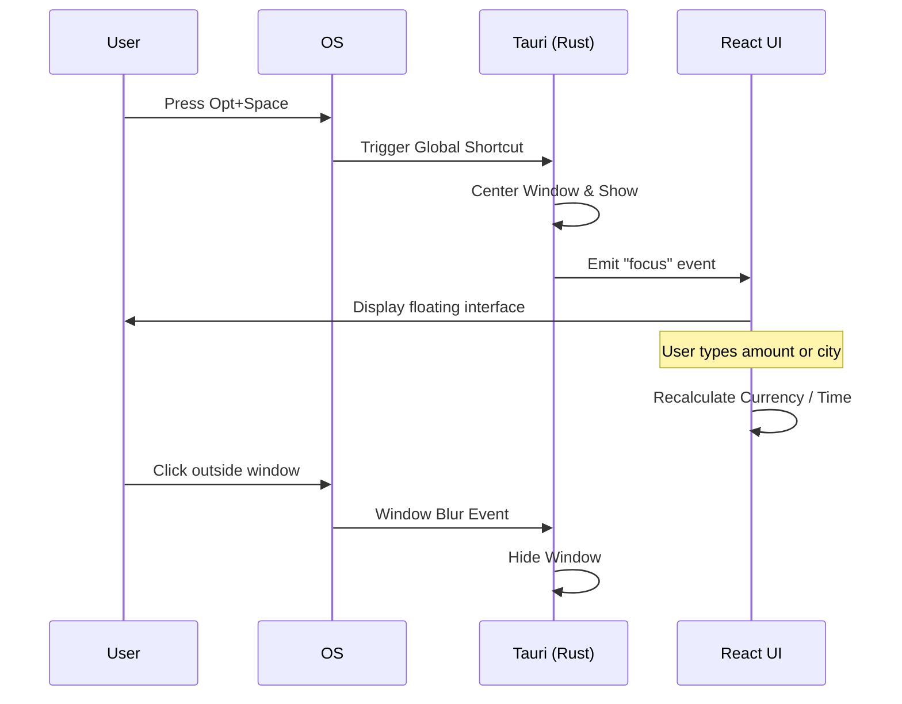

# Application Flow

This document outlines the user interaction flow and internal logic triggers.

## 1. User Interaction Flow

## 2. Logical Flow (Startup)
1. **Initialize Backend:** Load `sysinfo`, register global shortcuts.
2. **Load Config:** Read `config.json` via `tauri-plugin-store`.
3. **Frontend Hydration:** UI reads initial base currency and locations from store.
4. **Polling:** Start 5-second interval for system stats (RAM/Disk).

## 3. Extensibility
- **New Actions:** New shortcuts (e.g., Cmd+P for search) can be added to the Sequence Diagram.
- **Background Tasks:** Future tasks (e.g., auto-updates) should be added to the Logical Flow as parallel branches.
