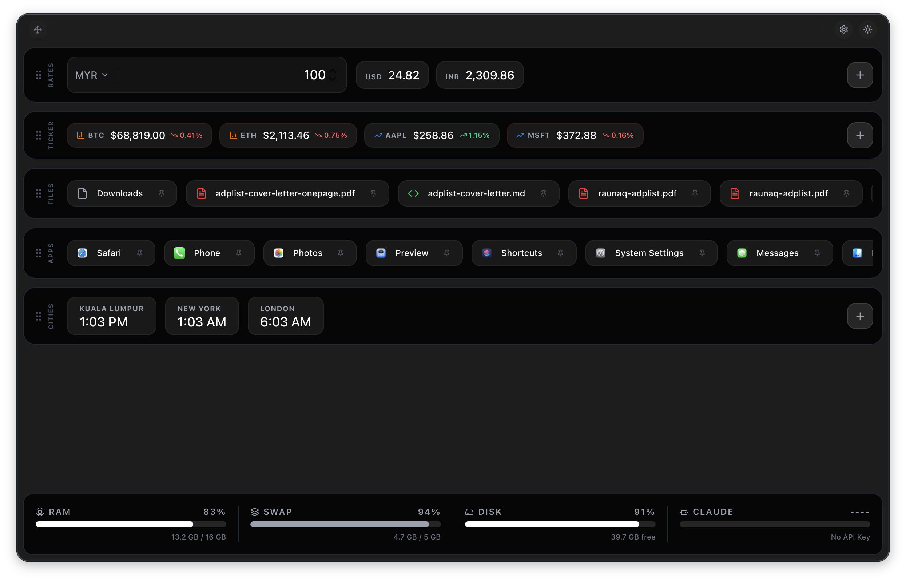

#  FluxBox

**The Ultra-Lightweight, Blazing Fast macOS Productivity Command Center.**

FluxBox is a premium menu bar utility designed for professionals who need instant access to system stats, market data, and recent workspace items without the bloat. Built with **Rust** and **Tauri**, it offers a "Raycast-like" experience with near-zero resource footprint.

<p align="center">
  
</p>

---

## ⚡ Core Philosophy
- **Built with Rust:** Native performance with memory safety.
- **Blazing Fast:** Instant "Summon" mechanic with `Alt + Space`.
- **Extremely Small:** Tiny binary size and minimal RAM usage.
- **Privacy First:** All data is stored locally on your machine.

---

## 🚀 Installation

### GitHub Release
Download the latest `.dmg` or `.app` from our [Releases Page](https://github.com/raunaqness/fluxbox/releases).

### Homebrew (Coming Soon)
```bash
brew install fluxbox
```

---

## ✨ Features
- **💱 Real-time Currency Converter:** Live rates with searchable dropdowns and custom base/target pairs.
- **📈 Global Market Tickers:** Track any Stock or Crypto ticker with live 24h change data (Powered by Yahoo Finance & CoinGecko).
- **⏱️ World Cities:** Dynamic time and weather tracking for multiple locations.
- **📂 Deep OS Integration:** One-click access to your most recently used Apps and Files.
- **🖥️ Hardware Monitoring:** Sleek, low-level monitoring of RAM, Swap, and Disk usage.
- **🤖 Claude Tracking:** Integrated dashboard for your Anthropic API usage.
- **🎨 Modern Aesthetics:** Fully theme-aware with native macOS vibrancy and blurred translucency.

---

## 📝 Roadmap & Feedback
Have a brilliant idea for a feature? Want to report a bug? 

👉 **[Request a Feature / Bug Report](https://forms.gle/placeholder)** *(Updated Link Coming Soon)*

---

## 📄 License
This project is licensed under the [MIT License](LICENSE).

---

<p align="center">
  Made by <a href="https://raunaqness.com/">Raunaq</a>
</p>
