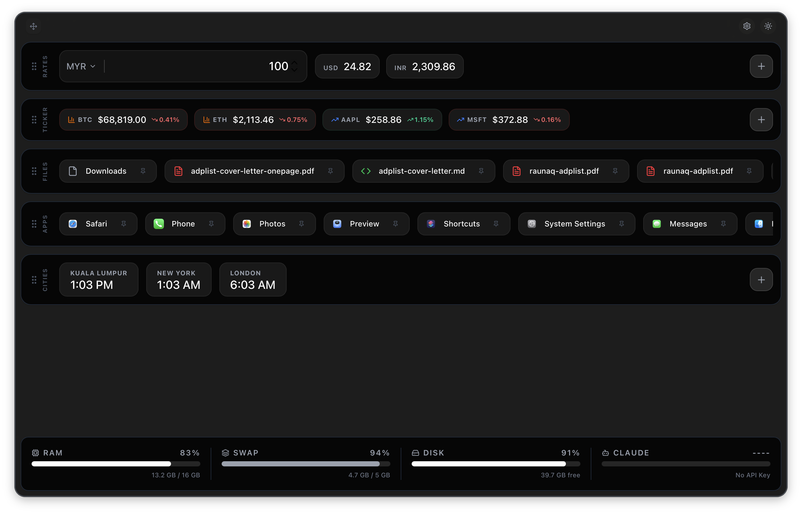

#  FluxBox

**The Ultra-Lightweight, Blazing Fast macOS Productivity Command Center.**

FluxBox is a premium menu bar utility designed for professionals who need instant access to system stats, market data, and recent workspace items without the bloat. Built with **Rust** and **Tauri**, it offers a "Raycast-like" experience with near-zero resource footprint.

<p align="center">
  
</p>

---

## ⚡ Core Philosophy
- **Built with Rust:** Native performance with memory safety.
- **Blazing Fast:** Instant "Summon" mechanic with `Alt + Space`.
- **Extremely Small:** Tiny binary size and minimal RAM usage.
- **Privacy First:** All data is stored locally on your machine.

---

## 🚀 Installation

### GitHub Release
Download the latest `.dmg` or `.app` from our [Releases Page](https://github.com/raunaqness/fluxbox/releases).

### Homebrew *(Apple Silicon only)*
```bash
brew tap raunaqness/fluxbox
brew install --cask fluxbox
```

---

## ✨ Features
- **💱 Real-time Currency Converter:** Live rates with searchable dropdowns and custom base/target pairs.
- **📈 Global Market Tickers:** Track any Stock or Crypto ticker with live 24h change data (Powered by Yahoo Finance & CoinGecko).
- **⏱️ World Cities:** Dynamic time and weather tracking for multiple locations.
- **📂 Deep OS Integration:** One-click access to your most recently used Apps and Files.
- **🖥️ Hardware Monitoring:** Sleek, low-level monitoring of RAM, Swap, and Disk usage.
- **🤖 Claude Tracking:** Integrated dashboard for your Anthropic API usage. *(WIP — off by default; enable in Settings → Stats Bar Widgets. See below.)*
- **🎨 Modern Aesthetics:** Fully theme-aware with native macOS vibrancy and blurred translucency.

---

## ⚠️ Known Issue: Claude Status (WIP)

Claude Status is **not fully reliable yet**. Leave this for a follow-up session.

### How it works
- Does **not** use the Settings “Anthropic API Key” field (that field is unused by the fetch path).
- Reads the **Claude Code** OAuth token from macOS Keychain (`Claude Code-credentials`), then calls `GET https://api.anthropic.com/api/oauth/usage` with header `anthropic-beta: oauth-2025-04-20`.
- Requires the native Tauri app (`npm run tauri dev` / built `.app`) — browser-only Vite cannot invoke the Rust Keychain/API path.

### What we already shipped
- Opt-in from **Settings → Stats Bar Widgets → Claude Status** (off by default). Enabling the widget also starts monitoring (`claude_monitoring_enabled`).
- On failure: shows **Error fetching Claude Status** + **Retry** (no raw Keychain/API strings).
- Parser made more resilient to null `resets_at` and the newer `limits[]` response shape (`session` / `weekly_all` / `weekly_scoped`), with fallback to legacy `five_hour` / `seven_day` keys.

### Still broken / to investigate
- Parsing or mapping still fails for some real accounts (console: `Failed to parse API response: error decoding response body`, or post-fix incomplete data).
- Capture a real (redacted) response body from the usage endpoint and align structs to it.
- Confirm whether token refresh is needed when the Keychain access token is expired.
- Decide fate of the unused Anthropic API Key settings field (remove or wire up).

### Quick retest checklist
1. `cd ~/Desktop/dev/fluxbox && npm run tauri dev` — use the **native window**, not localhost in a browser.
2. Settings → enable **Claude Status** → Allow Keychain if prompted → check bars vs error + Retry.

---

## 📝 Roadmap & Feedback
Have a brilliant idea for a feature? Want to report a bug? 

👉 **[Request a Feature / Bug Report](https://github.com/raunaqness/fluxbox/issues)**

---

## 🔒 Privacy & Telemetry

FluxBox collects **minimal, anonymous analytics** via [Aptabase](https://aptabase.com) — solely to count daily active users and understand which app versions are in use. No personal data, hardware fingerprints, or account information is ever collected.

**What is tracked:**
- `app_started` — fired once per launch to count active users

**What Aptabase auto-attaches:**
- OS version, app version, CPU architecture, locale/region
- An ephemeral session ID (not tied to hardware or identity)

**What is never tracked:** your files, search queries, API keys, currencies, or any personal data.

---

## 📄 License
This project is licensed under the [MIT License](LICENSE).

---

<p align="center">
  Made by <a href="https://raunaqness.com/">Raunaq</a>
</p>
